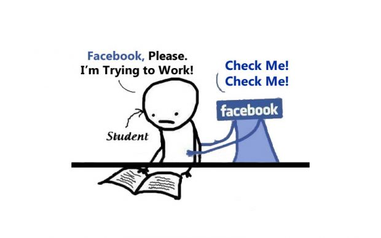

# Participants wanted for study of Facebook distraction

Are you often distracted by Facebook while you work?

Human Centered Computing are doing a study to learn which parts of Facebook distract users and what might be done about it. We are looking for student participants at Oxford University (non-freshers), aged 18-30.

You would come with your laptop to a room at your college twice, for about 20 minutes, fill in questionnaires about yourself and how you use Facebook, and install a browser extension that measures the time you spend.

If you are interested, please contact Ulrik Lyngs (Department of Computer Science, University of Oxford) on <a href="mailto:ulrik.lyngs@cs.ox.ac.uk">ulrik.lyngs@cs.ox.ac.uk</a>. There is no obligation to take part.

**You will be compensated for your time.** You will also receive data and visualisations of your own Facebook use which you may find useful and thought-provoking.

*This research project has received ethics approval (ref no. SSD/CUREC1A CS_C1A_18_023) by the Computer Science Departmental Research Ethics Committee, at the University of Oxford, UK*

 

